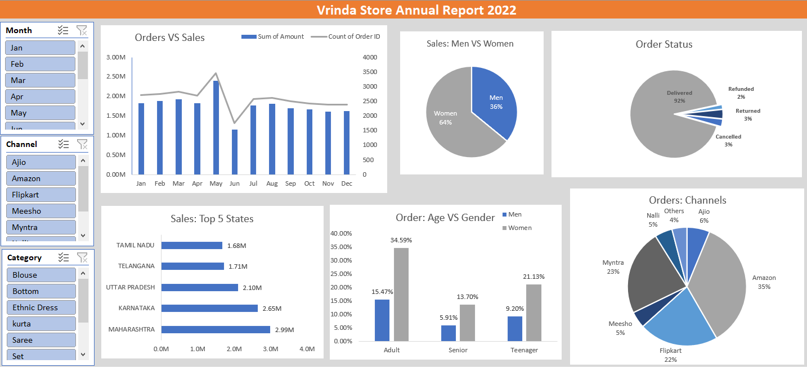

# Vrinda_Store_Data_Analysis_Using_Excel
 

## Project Overview
The Vrinda Store Data Analysis project involves a comprehensive analysis of sales data to uncover valuable business insights.

## Data Techniques
Using advanced Excel techniques such as Pivot Tables, Pivot Charts, Data Sorting, Data Cleaning, and Data Formatting, the project identifies key trends in customer behavior and sales performance.

## Key Insights
Analysis reveals that women are the primary customers (approximately 65%), with the top states being Maharashtra, Karnataka, and Uttar Pradesh. The major buying age group is adults aged 30-49, and the leading sales channels are Amazon, Flipkart, and Myntra.

## Recommendations
To enhance sales, the focus should be on targeting women aged 30-49 in the aforementioned states through tailored advertisements and promotions on the top-performing sales platforms.

## Conclusion
This project not only highlights essential market trends but also provides actionable strategies for increasing sales at Vrinda Store.